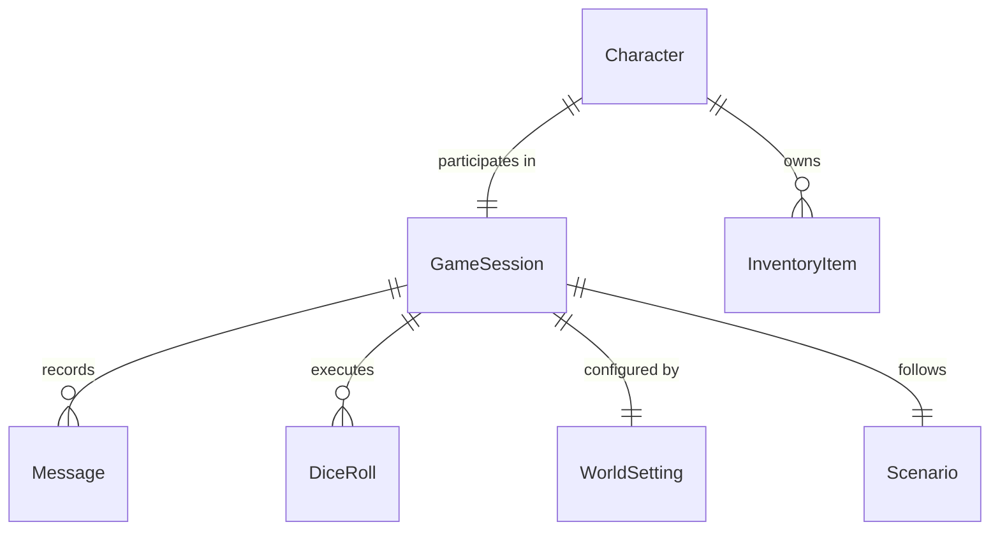

# Game Architecture & Design

This document details how the AI Dungeon Master backend handles game loops, state updates, data models, and the AI integration layer.

---

## High-Level Overview
AI Dungeon Master is a text-based roguelike RPG powered by structured AI narration. The gameplay is built around interactive encounters handled via modular sub-systems: **cards, dice rolls, turn-based combat, loot generation, dynamic quests, and permanent death (meta-progression).**

---

## App Map (Django Applications)

The codebase is organized into isolated Django apps, each owning a distinct domain:

* **`accounts`**: User authentication, profiles, and account settings.
* **`characters`**: Character sheets, attributes/stats calculation, active perks, and visual gear.
* **`game`**: Core gameplay coordinator. Contains specialized architectural submodules: `combat`, `dice`, `loot`, and `quests`.
* **`ai`**: Engine infrastructure responsible for LLM API contracts, prompt rendering, and response parsing.
* **`world`**: Database records for environments, world settings, and background biomes.
* **`core`**: Base layout mixins, shared utility tasks, and global frontend components.
* **`legacy`**: Meta-progression systems triggered upon character death (score calculation, permanent vault relics).

---

## Data Model (ER Diagram)


	
## AI Tag Contract & Parser Rules

To synchronize unstructured textual descriptions with explicit UI states, the AI output utilizes a strict markup tag grammar parsed inside the ai app (built under #62 BE-07).

* **Tag Grammar Rules:**

* <scene>...</scene>: High-fidelity narrative detailing the environmental resolution. Budget: 50–150 words.

* <action_1>, <action_2>: Text values mapped strictly to interface selection options. Budget: 3–6 words max per label.

* **Parser Outputs:** Generates a structured python dictionary returned into views:
	```python
{
    "narration": "The heavy iron door creaks open revealing...",
    "options": ["Examine the altar", "Step back quietly"]
}
	```